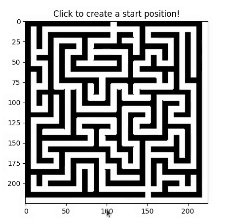

# Maze Solver
### This simple program is written to navigate a robot from one location in a maze to other location. It uses various AI search algorithms to do so.
## Language Used
---
- Python-3.6.9
## Dependencies
---
- Matplotlib
- opencv-python
- Numpy
- Pillow

## Features
--- 
- Various search algorithms like A-star, Best-First-search,Breadth-First-Search, Depth-First-Search, Hill Climbing are implemented and their behaviour can be seen visually.
- Written in Python-3.6.9
- Can easily be modified or any other algorithms can also be implemented easily 

## How to add your own map
---
- download any black and white maze image from internet or any custom made map image.
- Change the filename variable in 'maze .py' to name of your map image.
- If required tweak the variable 'pixels_per_step'.